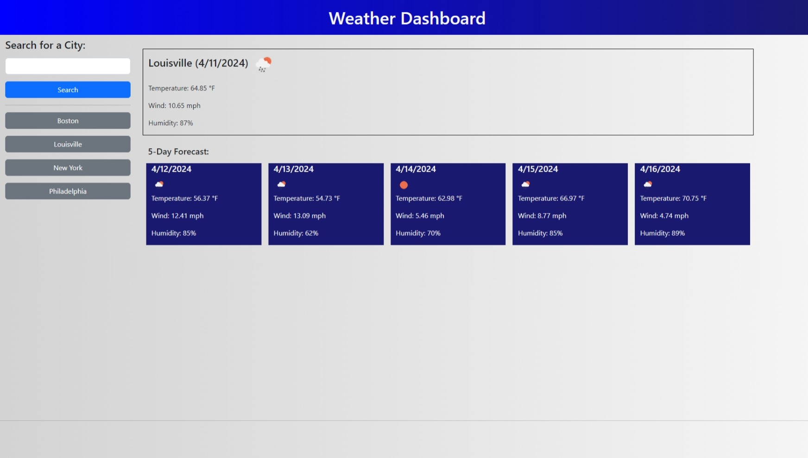

# Weather Dashboard

## Description

This webpage was written to be able to display the weather forecast for a city that the user inputs.
It allows the user to enter a city - the field is required.
As each search is completed, a button will be added below 
the search form for easy access to search for the weather for that particular city again.
Once a city has been searched for,
the current days weather will be displayed on top containing the city name, date, icon describing 
the weather along with the temperature, wind and humidity.
Below the current days weather will be the following 5 days weather,
containing the date, icon describing the weather, temperature, wind and humidity.
Also, the weather data is stored in localStorage so that we are only reaching out to the OpenWeather API when we need a new set of data.
I built this project because it gave me valuable experience practicing what I have learned about Bootstrap, jQuery and dayJS.
It also continued my use of localStorage.
I learned how to create html elements from jQuery and how to use Bootstrap to customize the look and feel of the weather forecast.

## Usage

To use the webpage, please navigate to https://mattm479.github.io/weather-dashboard. You will need to input a city to view the weather forecast fore task - the city input field is required and then click Search to view the weather data. This webpage will look similar to the screenshot below:

## License

License can be found [here](LICENSE).